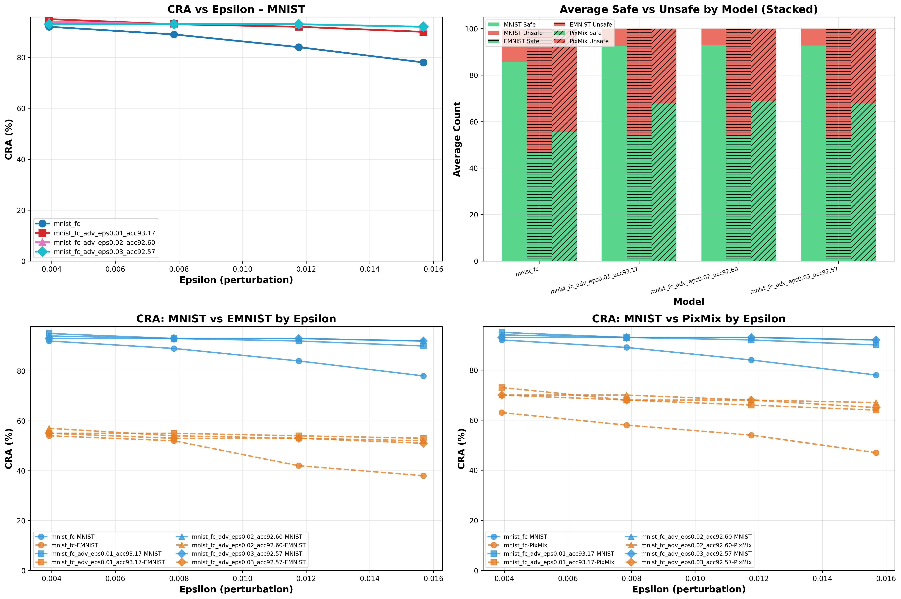

# Robustness - Generalization Exploration Project

This repository contains tools and scripts for studying the generalization of neural network verification across models with similar accuracy but different Certified Robust Accuracy (CRA). The workflow involves training models, generating verification properties, running verification, and analyzing results.

## Overview

The goal is to create models A, B, C, ..., D with similar accuracy but different CRA, then verify them using the same set of properties to understand the realtionship between robustness and generalizability.

## Workflow

The complete workflow consists of 5 main steps:

1. **Train models** with close accuracy
2. **Generate properties** (VNNLIB files)
3. **Generate config files** (`.yaml`) for Alpha-Beta-Crown
4. **Run verification** and collect results
5. **Create tables and plots** from results

---

## STEP 1: Get Models with Close Accuracy

Train a plain model first, then use adversarial training with different epsilon values to create models with similar accuracy but different CRA.

### Training a Plain Model

```bash
CUDA_VISIBLE_DEVICES=1 python train_mnist.py --epochs 20
```

This will:
- Train a standard MNIST fully-connected model
- Save the checkpoint to `./checkpoints/mnistfc/mnist_fc.pt`
- Output the final test accuracy

### Training Adversarially Trained Models

Starting from the plain model, train adversarially trained models with different epsilon values. Training stops when the target accuracy is reached:

```bash
# Example: Train with epsilon=0.03, target accuracy 93%
CUDA_VISIBLE_DEVICES=1 python train_mnist.py \
    --checkpoint "checkpoints/mnistfc/mnist_fc.pt" \
    --use_adversarial \
    --adv_epsilon 0.03 \
    --epochs 20 \
    --target_acc 0.93
```

**Parameters:**
- `--checkpoint`: Path to the base model checkpoint
- `--use_adversarial`: Enable adversarial training (PGD attack)
- `--adv_epsilon`: Epsilon value for adversarial perturbation (e.g., 0.01, 0.03, 0.05)
- `--adv_alpha`: Step size for PGD attack (default: 0.01)
- `--adv_steps`: Number of PGD steps (default: 10)
- `--target_acc`: Target test accuracy (0-1). Training stops early when reached
- `--epochs`: Maximum number of epochs

**Output:**
Models are saved to `./checkpoints/mnistfc/` with names like:
- `mnist_fc_adv_eps0.03_acc93.17.pt`

### Training Tips

- Start with a plain model to establish baseline accuracy
- Use different `--adv_epsilon` values (0.01, 0.03, 0.05) to create models with different robustness
- Adjust `--target_acc` to match the plain model's accuracy for fair comparison
- Monitor adversarial accuracy during training to understand robustness improvements

---

## STEP 2: Generate Properties

Generate VNNLIB property files for verification. We use the same set of properties to verify different models.

See [`generate_properties/README.md`](generate_properties/README.md) for detailed instructions.

### Quick Start

```bash
cd generate_properties/mnistfc

# Generate MNIST properties (10 samples per class, balanced)
python generate_mnist_properties.py 42

# Generate EMNIST properties
python generate_emnist_properties.py 42

# Generate PixMix OOD properties
python generate_pixmix_mnist_properties.py
```

**Output:**
- VNNLIB files: `mnist/prop_{i}_{eps}over255.vnnlib`
- CSV files: `mnist/mnistfc_instances_eps{eps}over255.csv` (one per epsilon)

The CSV files list all VNNLIB property files and are used as input to the verification tool.

---

## STEP 3: Generate Config Files (`.yaml`) for Alpha-Beta-Crown

Create YAML configuration files that specify:
- Model path
- Property CSV file
- Verification parameters
- Solver settings

### Config File Structure

Example config file (`mnist_fc_eps_4over255.yaml`):

```yaml
model:
  name: mnist_fc  # Model name (defined in model_defs.py)
  path: ./checkpoints/mnistfc/mnist_fc.pt  # Path to PyTorch checkpoint
  input_shape: [-1, 1, 28, 28]  # Input shape: [batch, channels, height, width]

general:
  # Root path containing the CSV file
  root_path: ./generate_properties/mnistfc/mnist
  # CSV file name (contains list of VNNLIB property paths)
  csv_name: mnistfc_instances_eps4over255.csv
  enable_incomplete_verification: False

data:
  dataset: mnist  # Dataset name
  start: 0        # Start index in CSV
  end: 100        # End index in CSV

attack:
  pgd_restarts: 50  # Number of PGD restarts for attack

solver:
  batch_size: 1024  # Batch size for bound computation
  beta-crown:
    iteration: 20    # Number of beta-CROWN iterations

bab:
  timeout: 60  # Timeout per instance (seconds)
```

### Creating Config Files

You can create config files manually or use a script. For each model and epsilon combination:

1. **Set the model path** to your trained checkpoint
2. **Set the CSV file** to the corresponding property CSV
3. **Adjust solver parameters** based on your needs:
   - `batch_size`: Increase for faster verification (requires more memory)
   - `timeout`: Increase to verify more instances (but takes longer)
   - `beta-crown.iteration`: More iterations = tighter bounds but slower

### Example: Generate Configs for Multiple Models

Create a script to generate configs for all model/epsilon combinations:
Run the following script files:

```bash
cd ./alpha_beta_CROWN/complete_verifier/sh && bash generate_yml_configs_mnist.sh
```
Save configs to `alpha_beta_CROWN/complete_verifier/exp_configs/generalizability/mnist/`

---

## STEP 4: Run Verification and Collect Results

Run Alpha-Beta-Crown verification using the generated config files.

### Basic Usage

```bash
cd alpha_beta_CROWN/complete_verifier

# Run verification for a single config
python abcrown.py --config exp_configs/generalizability/mnist/mnist_fc_eps_4over255.yaml
```

### Batch Verification

Use the provided script to run verification for multiple configs:

```bash
# Run verification for all configs
cd ./alpha_beta_CROWN/complete_verifier/sh && 
./run_all_configs.sh --pattern "mnist_fc_eps_0.03" --continue-on-error --log-dir "/home/judy/code/unlearning-verification/alpha_beta_CROWN/expr01_logs"
```
Replace pattern with the prefix of models of interest.

This script:
- Runs verification for each YAML config
- Logs output to separate log files
- Extracts results and generates a summary CSV

### Verification Output

The verifier produces:
- **Console/log output**: Progress and per-instance results
- **Result file** (`.npz`): Pickle file with detailed results
- **Summary statistics**: Verified, falsified, unknown, timeout counts

**Result Status:**
- `verified` / `safe` / `unsat`: Property holds (robust)
- `falsified` / `unsafe` / `sat`: Counterexample found (not robust)
- `unknown` / `timeout`: Could not determine within timeout

---

## STEP 5: Create Tables and Plots

Extract results from logs and result files to create analysis tables and visualizations.

### Extract Results from Logs

Use the provided extraction script:

```bash
cd ./alpha_beta_CROWN/complete_verifier/sh && 
./collect_results.sh your_log_dir --output your_csv_output
```

Example:
```bash
./collect_results.sh ../expr02_logs/mnist_pixmix --output ../../results/final_results_mnist_pixmix_fc.csv
```

### Creating Analysis Tables

Create tables comparing:
- **CRA (Certified Robust Accuracy)**: Percentage of verified properties
- **Standard Accuracy**: Test set accuracy
- **Verification Time**: Average time per instance
- **Epsilon Values**: Different perturbation sizes

Example table structure:

| Model | Accuracy | CRA (ε=1/255) | CRA (ε=2/255) | CRA (ε=3/255) | CRA (ε=4/255) |
|-------|----------|---------------|---------------|---------------|---------------|
| Plain | 93.50%   | 85.00%        | 72.00%        | 58.00%        | 45.00%        |
| Adv (ε=0.01) | 93.60% | 88.00%        | 78.00%        | 65.00%        | 52.00%        |
| Adv (ε=0.03) | 93.17% | 90.00%        | 82.00%        | 70.00%        | 58.00%        |

### Creating Plots

Visualize:
- **CRA vs Epsilon**: Line plot showing how CRA decreases with epsilon
- **CRA vs Model**: Bar chart comparing CRA across models
- **Verification Time Distribution**: Histogram of verification times
- **Trade-off Analysis**: Accuracy vs CRA scatter plot

Example plotting code:

```python
import matplotlib.pyplot as plt
import pandas as pd

# Load results
df = pd.read_csv('results/extracted_results.csv')

# Plot CRA vs Epsilon for different models
for model in df['model'].unique():
    model_data = df[df['model'] == model]
    plt.plot(model_data['epsilon'], model_data['cra'], 
             label=model, marker='o')

plt.xlabel('Epsilon')
plt.ylabel('Certified Robust Accuracy (%)')
plt.title('CRA vs Epsilon for Different Models')
plt.legend()
plt.grid(True)
plt.savefig('cra_vs_epsilon.png')
```

Or simply using the current code:
```bash
# Pass a different CSV
python create_final_table.py /path/to/other_results.csv
```



---

## Directory Structure

```
veri-generalization/
├── README.md                    # This file
├── train_mnist.py              # Model training script
├── checkpoints/                 # Trained model checkpoints
│   └── mnistfc/
├── datasets/                    # Dataset storage
│   ├── MNIST/
│   └── EMNIST/
├── generate_properties/         # Property generation scripts
│   ├── README.md
│   └── mnistfc/
│       ├── generate_mnist_properties.py
│       ├── generate_emnist_properties.py
│       ├── generate_pixmix_mnist_properties.py
│       ├── mnist/               # Generated MNIST properties
│       └── emnist/               # Generated EMNIST properties
└── alpha_beta_CROWN/            # Alpha-Beta-Crown verifier
    └── complete_verifier/
        ├── abcrown.py           # Main verification script
        └── exp_configs/
            └── generalizability/
                ├── mnist/       # MNIST verification configs
                │   ├── *.yaml   # Config files
                │   ├── logs/    # Verification logs
                │   ├── results/ # Extracted results
                │   ├── run_verification.py
                │   └── extract_results_from_logs.py
                └── emnist/      # EMNIST verification configs
```

---

## Tips and Best Practices

### Training Models
- **Monitor both clean and adversarial accuracy** during training
- **Use early stopping** with `--target_acc` to match accuracies across models
- **Save checkpoints regularly** to resume training if needed
- **Experiment with different epsilon values** for adversarial training

### Generating Properties
- **Use the same seed** for reproducibility
- **Generate balanced properties** (equal samples per class) for fair comparison
- **Generate properties for multiple epsilon values** to study robustness at different perturbation levels

### Running Verification
- **Start with small batches** (`--start` and `--end` parameters) to test configs
- **Adjust timeout** based on instance difficulty
- **Use GPU** (`CUDA_VISIBLE_DEVICES`) for faster verification
- **Monitor memory usage** and adjust `batch_size` accordingly

### Analyzing Results
- **Compare CRA across models** with similar accuracy
- **Analyze verification time** to identify hard instances
- **Study the trade-off** between standard accuracy and CRA
- **Visualize results** to identify patterns and trends

---

## References

- **Alpha-Beta-Crown**: [GitHub Repository](https://github.com/huanzhang12/alpha-beta-CROWN)
- **VNNLIB Format**: [VNN-COMP Specification](https://github.com/stanleybak/vnncomp2021)
- **Property Generation**: See `generate_properties/README.md`

---

## License

See individual component licenses in their respective directories.
